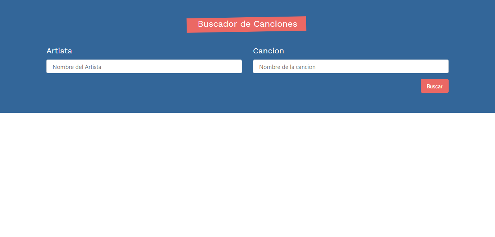

<h1>Lyric Application</h1>
<h2>Description</h2>
<p>Small application to search for information about musical groups and their lyrics </p>
<h2>Languages</h2>
<ul>
  <li>HTML</li>
  <li>CSS</li>
  <li>JS</li>
</ul>
<h2>Tools</h2>
<ul>
  <li>React</li>
  <li>Hooks</li>
  <li>Bootstrap</li>
  <li>Axios</li>
  <li>APIs</li>
</ul>
<h2>Installation</h2>

```
npm install
```

<h2>Run the project</h2>

```
npm run start
```
<h2>Previews</h2>

Try the live demo https://compassionate-mirzakhani-34c9f6.netlify.app




